# JACCUS - Just Another CARLA Client for Unreal Simulation

> **Energy-efficient ADAS prototype for sustainable autonomous vehicle development**

JACCUS is a modular Advanced Driver Assistance Systems (ADAS) prototype built on the CARLA simulator. It focuses on energy-saving adaptive cruise control with dual-protocol communication support (MQTT5 + Zenoh) for comprehensive IoT ecosystem integration.

## 🚀 Quick Start

```bash
# Prerequisites: CARLA 0.9.15, Python 3.10, Mosquitto MQTT broker
cd /home/seame/criticallites/jaccus
just run-jaccus
```

Once launched, press `J` to activate Adaptive Cruise Control (ACC) for energy-efficient driving automation.

## 🏗️ Architecture Overview

JACCUS implements a layered architecture connecting simulated vehicle sensors to intelligent control algorithms via standard communication protocols.

```mermaid
flowchart TB
    subgraph "🚗 Simulation Environment"
        CARLA[CARLA 0.9.15<br/>Vehicle Simulation]
        Sensors[Vehicle Sensors<br/>Speed • Location • Proximity]
    end

    subgraph "🧠 JACCUS Core"
        Engine[ADAS Decision Engine<br/>ACC • PID Control • BehaviorAgent]
        UI[Driver Interface<br/>HUD • Controls • Notifications]
        Config[Configuration<br/>Parameters • Thresholds]
    end

    subgraph "📡 Communication Layer"
        MQTT[MQTT5 Broker<br/>IoT Integration]
        Zenoh[(Zenoh Router<br/>High-Performance)]:::deprecated
    end

    subgraph "⚡ Vehicle Control"
        Actuators[Vehicle Actuators<br/>Throttle • Brake • Steering]
        Feedback[Energy Feedback<br/>Efficiency Metrics]
    end

    CARLA -->|telemetry| Sensors
    Sensors -->|sensor data| Engine
    Engine -->|control commands| MQTT
    Engine -->|driver alerts| UI
    MQTT -->|vehicle control| Actuators
    Actuators -->|efficiency data| Feedback
    Feedback -->|metrics| UI

    %% Deprecated path
    Zenoh -.->|replaced by| MQTT

    classDef deprecated fill:#f9d6d5,stroke:#a33,stroke-dasharray: 5 5
```



### Key Components

- **Adaptive Cruise Control**: Energy-optimized speed management using CARLA's BehaviorAgent
- **MQTT5 Integration**: Standard IoT protocol for external system communication
- **Fallback Systems**: PID controller when BehaviorAgent unavailable
- **Modular Design**: Pluggable sensors, communication, and control modules

## 📋 Dependencies & Compatibility

### Required Dependencies
```bash
# Install Python dependencies
pip install -r targets/requirements.txt

# Key packages:
# - paho-mqtt==2.1.0 (MQTT5 support)
# - pygame>=2.0.0 (UI rendering)
# - numpy>=1.20.0 (numerical processing)
```

### Python Version Compatibility
- **Recommended**: Python 3.10+ on Ubuntu 22.04 LTS
- **CARLA Limitation**: Uses Python 3.7 egg files for compatibility
- **Known Issue**: Direct Python 3.10 + CARLA integration causes segfaults (see [challenges doc](../docs/initial-prototype-challenges.md))

### CARLA Setup
```bash
# CARLA 0.9.15 required at:
/home/seame/carla-simulator/PythonAPI/carla/dist/carla-0.9.15-py3.7-linux-x86_64.egg

# Verify CARLA installation:
cd /home/seame/criticallites/jaccus
./targets/setup_carla_env.sh
```

## 🎮 Usage

### Basic Operation
1. **Start CARLA Server** (separate terminal):
   ```bash
   cd /home/seame/carla-simulator && ./CarlaUE4.sh
   ```

2. **Launch JACCUS**:
   ```bash
   cd /home/seame/criticallites/jaccus && just run-jaccus
   ```

3. **Activate ACC**: Press `J` key to toggle Adaptive Cruise Control

### Key Controls
| Key | Function |
|-----|----------|
| `J` | Toggle Adaptive Cruise Control (ACC) |
| `+/-` | Adjust ACC target speed |
| `W/S/A/D` | Manual throttle/brake/steering |
| `P` | Toggle autopilot |
| `F1` | Toggle HUD |
| `ESC` | Quit application |

### MQTT Integration
JACCUS automatically connects to `localhost:1883` for MQTT communication:

```json
{
  "broker": "localhost",
  "port": 1883,
  "topics": {
    "vehicle_parameters": "vehicle/parameters",
    "vehicle_commands": "vehicle/commands"
  }
}
```

**Verification Steps:**
1. Start Mosquitto: `sudo systemctl start mosquitto`
2. Monitor data: `mosquitto_sub -t "vehicle/parameters"`
3. Send commands: `mosquitto_pub -t "vehicle/commands" -m '{"command":"cruise_control","value":true}'`

## 🧪 Testing & Development

### Integration Tests
```bash
# Test MQTT connectivity
python3 tools/mqtt_integration_test.py

# Test CARLA imports
python3 targets/test_carla_imports.py

# Full integration test
bash targets/test_mqtt_integration.sh
```

### Development Challenges
For detailed information about compatibility issues, segfault debugging, and protocol migration decisions, see:

📖 **[Initial Prototype Challenges](../docs/initial-prototype-challenges.md)**

This document covers:
- Ubuntu version compatibility matrix
- CARLA Python 3.7 vs 3.10 segfault resolution
- Zenoh → MQTT5 migration rationale

## 🏁 Project Status

### ✅ Completed Features
- Modular ADAS architecture with pluggable components
- MQTT5 communication with automatic fallback
- Energy-focused adaptive cruise control
- Cross-platform compatibility (Ubuntu 20.04/22.04)
- Comprehensive error handling and graceful degradation

### 🚧 Known Limitations
- BehaviorAgent requires exact CARLA 3.7 compatibility
- Zenoh integration disabled due to configuration complexity
- Limited to CARLA 0.9.15 simulation environment

### 🔮 Future Enhancements
- Container-based deployment for consistent environments
- Enhanced energy efficiency algorithms
- Multi-vehicle coordination protocols
- Real hardware integration pathways

---

## 📞 Support & Documentation

- **Architecture Details**: See individual module documentation in `targets/jaccus/`
- **Troubleshooting**: Check `targets/COMPATIBILITY_NOTES.md`
- **Development History**: Review `../docs/initial-prototype-challenges.md`

**Quick Links:**
- [MQTT Integration Guide](targets/MQTT_INTEGRATION.md)
- [CARLA Setup Notes](targets/setup_carla_env.sh)
- [Integration Tests](tools/mqtt_integration_test.py)

---

*Built for sustainable autonomous vehicle research • October 2025*
